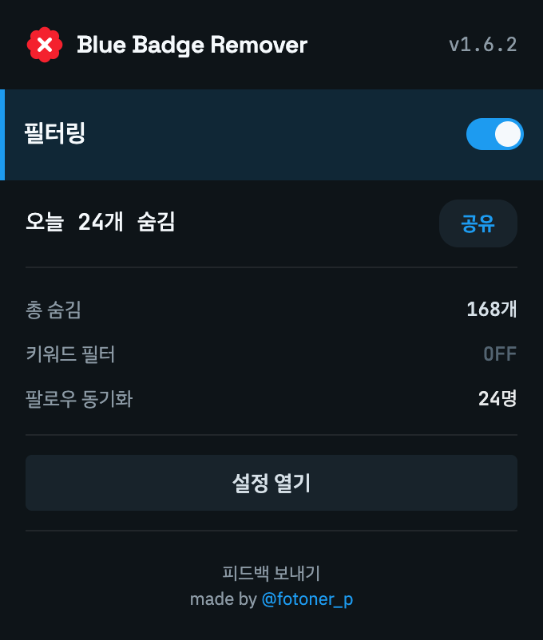
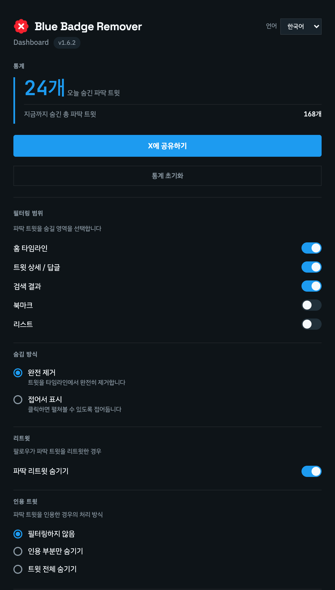

# Blue Badge Remover

X(트위터)에서 유료 파란 뱃지 계정의 글을 숨기는 브라우저 확장 프로그램입니다.
팔로우 중인 계정과 화이트리스트에 등록한 계정은 예외로 둡니다.

[Chrome 웹 스토어](https://chromewebstore.google.com/detail/blue-badge-remover/cjhmbgfnddpcdfmoicfcocekmainhhdm) · [Firefox 부가 기능](https://addons.mozilla.org/ko/firefox/addon/blue-badge-remover/) · [릴리스](https://github.com/fotoner/blue-badge-remover/releases)

## 화면



<details>
<summary>설정 화면 보기</summary>



</details>

현재 빌드의 한국어 화면입니다. 통계와 팔로우 수는 예시 데이터입니다.

## 주요 기능

- **범위와 방식 선택**: 타임라인·답글·검색·북마크·리스트에서 글을 숨기거나 접어서 표시합니다. 리트윗과 인용 처리도 설정할 수 있습니다.
- **예외 계정 유지**: 본인, 팔로우 계정, 화이트리스트 계정의 글과 리트윗을 유지합니다. 금색·회색 인증 뱃지는 숨김 대상에서 제외합니다.
- **선택 필터**: 키워드 필터를 켜면 내장 카테고리·커스텀 규칙·필터 팩에 맞는 파란 뱃지 계정만 숨깁니다. 별도로 [신규 고확산 계정 필터](docs/AGGRESSOR_FILTER.md)도 제공합니다.
- **보호 키워드**: 아이디·이름·프로필 소개에 지정한 단어가 있는 계정을 예외로 둡니다.
- **목록 관리**: 화이트리스트 일괄 추가, 필터 팩 가져오기·내보내기, 화이트리스트·커스텀 필터·보호 키워드의 JSON 백업을 지원합니다.
- **통계와 언어**: 오늘·전체 숨김 수와 키워드 카테고리별 통계를 확인할 수 있습니다. 한국어·영어·일본어를 지원합니다.

## 설치와 사용

Chrome은 [웹 스토어](https://chromewebstore.google.com/detail/blue-badge-remover/cjhmbgfnddpcdfmoicfcocekmainhhdm), Firefox는 [부가 기능 페이지](https://addons.mozilla.org/ko/firefox/addon/blue-badge-remover/)에서 설치합니다.
Edge는 [릴리스](https://github.com/fotoner/blue-badge-remover/releases)의 Edge ZIP을 압축 해제한 뒤, `edge://extensions`에서 **개발자 모드 → 압축 해제된 확장 로드**로 폴더를 선택합니다.

1. X에 로그인하고, 이미 열려 있던 페이지는 새로고침합니다.
2. 확장 아이콘을 눌러 필터링을 켜거나 끕니다. 세부 옵션은 **설정 열기**에서 변경합니다.
3. 팔로우 정보는 사용 중 자동으로 감지합니다. 누락된 계정이 있다면 설정의 **팔로잉 페이지 열기**를 누르고 스크롤하여 수집합니다.
4. 예외 계정은 **화이트리스트 관리**, 키워드·보호 키워드·목록 백업은 **고급 필터 설정**에서 관리합니다.

기본값은 타임라인·답글·검색에서 완전 숨김입니다. 북마크·리스트·인용·선택 필터는 기본적으로 꺼져 있습니다.

## 개발

TypeScript, WXT, Vitest, Playwright를 사용합니다. Node.js 22와 npm 기준입니다.

```bash
npm ci
npm run dev            # 개발 서버
npm run build          # Chrome → dist/chrome-mv3/
npm run build:firefox  # Firefox → dist/firefox-mv2/
npm run build:edge     # Edge → dist/edge-mv3/
npm test
npx tsc --noEmit --skipLibCheck
```

- **Chrome / Edge**: `chrome://extensions` 또는 `edge://extensions`에서 개발자 모드를 켜고, 해당 빌드 폴더를 **압축 해제된 확장 로드**로 선택합니다.
- **Firefox 개발 빌드**: `about:debugging#/runtime/this-firefox` → **임시 부가 기능 로드**에서 `dist/firefox-mv2/manifest.json`을 선택합니다. 임시 설치는 브라우저를 종료하면 해제됩니다.

코드 구조는 [아키텍처](docs/ARCHITECTURE.md), 작업 규칙은 [컨벤션](docs/CONVENTIONS.md)을 참고하세요.

## 데이터 처리

X 페이지와 브라우저가 수신한 API 응답에서 뱃지·프로필·팔로우 정보를 읽어 필터링합니다.
설정·목록·통계는 브라우저에 저장하며, 인증 토큰을 저장하거나 X에 글·좋아요·팔로우 요청을 보내지 않습니다.
설정 화면의 웹 폰트 로딩 등 외부 리소스 요청은 발생할 수 있습니다.

권한은 `storage`, `unlimitedStorage`와 X·Twitter 및 API 도메인 접근입니다. 자세한 데이터 처리 내용은 [개인정보 처리방침](docs/PRIVACY.md)을 참고하세요.

## 라이선스와 문의

[MIT](LICENSE) · [문제 제보](https://github.com/fotoner/blue-badge-remover/issues) · [@fotoner_p](https://x.com/fotoner_p)
